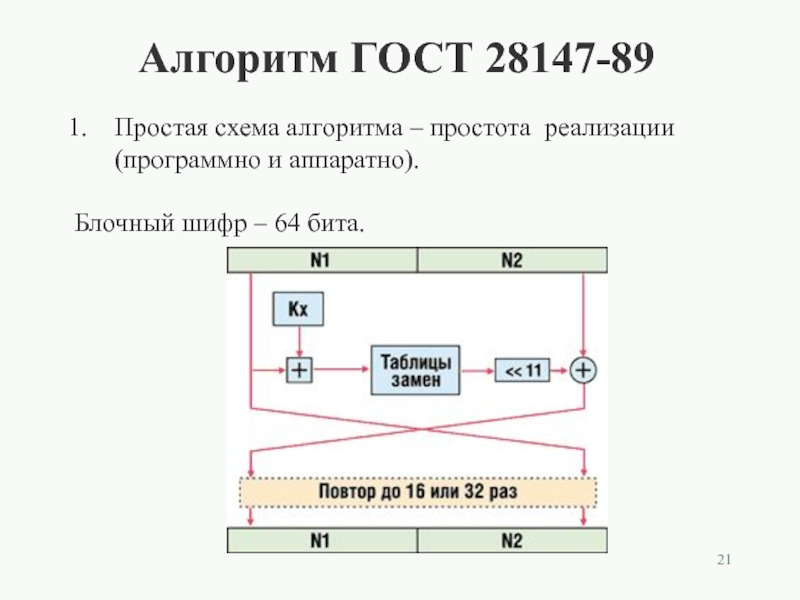
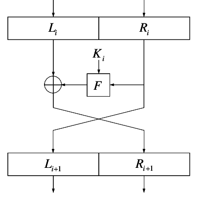

# gost-28147-89
GOST 28147-89 is the state standard of the USSR (and later the interstate standard of the CIS), describing the algorithm of symmetric block encryption and its modes of operation.

It is an example of DES-like cryptosystems created according to the classical Feistel iterative scheme.

The history of the cipher creation and the developer criteria were first publicly presented in 2014 by Ivan Alexandrovich Zabotin, head of the algorithm development team, at a lecture dedicated to the 25th anniversary of the adoption of the Russian symmetric encryption standard.

Work on the algorithm, which later became the basis of the standard, began within the framework of the topic "Magma" (protection of information by cryptographic methods in computers of a number of Unified Systems) on behalf of the Scientific and Technical Council of the Eighth Main Directorate of the KGB of the USSR (now in the structure of the FSB), in March 1978, after a long preliminary study of the DES standard published in 1976. In fact, work on creating an algorithm (or a group of algorithms) similar to the DES algorithm began as early as 1976.

Initially, the works were classified as "Top secret". Then they were downgraded to the "Secret" category. In 1983, the algorithm was downgraded to the mark "For official use". It was with the last note that the algorithm was prepared for publication in 1989. On March 9, 1987, a group of cryptographic developers (applicant - v/h 43753) received an author's certificate with priority No. 333297 for an invention for an encryption device using the Magma—2 algorithm.

## Feistel network
Feistel network, or Feistel construction (English Feistel network, Feistel cipher), is one of the methods of building block ciphers. The network consists of cells called Feistel cells. Data and a key are received at the input of each cell. At the output of each cell, the modified data and the modified key are received. All cells are of the same type, and it is said that the network is a certain repetitive (integrated) structure. The key is selected depending on the encryption/decryption algorithm and changes when moving from one cell to another. The same operations are performed during encryption and decryption; only the order of the keys differs. Due to the simplicity of operations, the Feistel network is easy to implement both programmatically and hardware. A number of block ciphers (DES, RC2, RC5, RC6, Blowfish, FEAL, CAST-128, TEA, XTEA, XXTEA, etc.) use the Feistel network as the basis. An alternative to the Feistel network is the substitution-permutation network (AES, etc.).

# How the algorithm works

This 64-bit block encryption algorithm works like this: the first block must be formed with the key. N1 + Kx (where x is the iteration number) and divide modulo 2^32. Next, a tabular replacement occurs, through which we pass a number, and this number is replaced by the number that is in this table. Next, the register is shifted by 11 positions. We mix the resulting 32-bit block with the second one and swap them. And we do this up to 16 or 32 times.

Attention: table substitution is not defined by the standard, you can use your own table, and perhaps this will increase or decrease the cryptographic strength of your algorithm.
